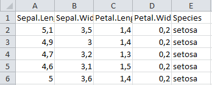
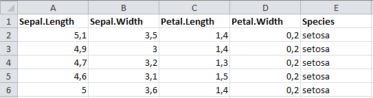
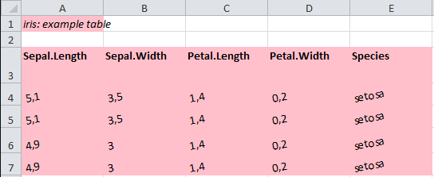

```{r}

library(tatoo)

```

# Introduction

As of v.1.1.0 **tatoo** assigns *named regions* when writing .xlsx files. 
**tatoo** can use these named regions to painlessly apply formatting to tables
inside Excel workbooks in bulk.


# Example

```{r, eval = FALSE}
wb <- as_workbook(iris[1:5, ])
```



```{r, eval = FALSE}
style_colnames <- openxlsx::createStyle(textDecoration = "bold")

walk_regions(wb, "colnames", openxlsx::addStyle, style_colnames)
walk_regions(wb, "table",    openxlsx::setColWidths, widths = 14)

```




# Named region names

The names of the named regions associated with a table are constructed from the 
following elements:

* The table_id (`table_id<-()`), if the table has one. A table id can be an
  arbitrary character string, but save yourself some trouble and don't use 
  special characters.
* The type of the table, possible values:
    * row_mashed_table
    * col_mashed_table
    * composite_table
    * table (for a simple data.frame)
* The part of the table
    * header (for Tagged_tables, constructed from title, longtitle, subtitle)
    * footer (for Tagged_tables)
    * colnames
    * multinames (for Composite_tables)
    * body (The actual values in the table, without colnames)
* An 8-character random string to ensure uniqueness of the region name
  
 
**Examples:**

```{r}
 show_regions <- function(x){
   unique(regions(as_workbook(x))$region)
 }
```


```{r}
show_regions(mash_table(iris, iris))
show_regions(mash_table(iris, iris, mash_method = "col"))
show_regions(comp_table(iris, iris))
show_regions(stack_table(iris, iris))
show_regions(tag_table(
  iris, 
  tt_meta(
    table_id = "tab1", 
    title = "a title", 
    footer = "blahblubb")
))

```


# Formatting parts of tables with walk_regions

`walk_regions()` is a way to apply formatting to Workbook regions.
The syntax is inspired by `purrr::walk()`. `walk_regions()` takes the
following arguments:

* `.wb` an openxlsx::Workbook
* `.pattern` A regex filter pattern for named region
   names (passed on to `grep()`). If you don't know regex, you will
   usually be fine just entering the part of the string you want to match.
* `.fun` A function with the formal arguments `wb`, `sheet` and either
   `rows`, `cols`, or both. Some useful functions to use are
   `openxlsx::addStyle()`, `openxlsx::addFilter()`, `openxlsx::setRowHeights()`
   and `openxlsx::setColWidths()`, but you can also write your own functions,
   as long as they have the correct arguments.
* `...` passed on as additional arguments to `.fun`


**Examples**

The following examples show how `walk_regions()` can be used to format column
names, table captions (headers) and the values inside a table (body).


```{r, results = "hide"}

x <- mash_table(
  iris[1:2, ], 
  iris[1:2, ],
  meta = tt_meta(table_id = "iris", title = "example table")
) 
wb <- as_workbook(x)

style_iris     <- openxlsx::createStyle(fgFill = "pink")
style_header   <- openxlsx::createStyle(textDecoration = "italic")
style_colnames <- openxlsx::createStyle(textDecoration = "bold", valign = "top")
style_body     <- openxlsx::createStyle(textRotation = 10)


walk_regions(wb, "iris", openxlsx::addStyle, style = style_iris)
walk_regions(wb, "header", openxlsx::addStyle, style = style_header, stack = TRUE)
walk_regions(wb, "colnames", openxlsx::addStyle, style = style_colnames, stack = TRUE)
walk_regions(wb, "body", openxlsx::addStyle, style = style_body, stack = TRUE)


# You can also use functions that have *either* the rows or cols argument,
# so the following works:
walk_regions(wb, "table", openxlsx::setColWidths, widths = 14)
walk_regions(wb, "colnames", openxlsx::setRowHeights, heights = 34)

```



