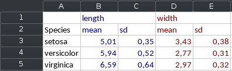

```{r message=FALSE, warning=FALSE}
library(dplyr)
library(tatoo)
```

# Introduction

Tatoo ("Table Tools") provides three straight-forward helper to combine multiple
`data.frames` to tables that are otherwise awkward to create in base-r, and a
way to add metadata (id, title, ...) to a table. 

Tatoo tables can directly be saved to .xlsx files, or convert to `Workbook` 
objects with `as_workbook()` so that you can process them further using the 
awesome `openxlsx` package. While tatoo implements convenient print methods so 
that you can preview the tables you created in the console, most of the
functionality provided by this package only makes real sense for .xlsx export.

# Setup example data
```{r}
df1 <- iris %>% 
  dplyr::group_by(Species) %>% 
  dplyr::summarise(
    length = mean(Sepal.Length),
    width  = mean(Sepal.Width)) %>% 
   hammr::df_round(2)

df2 <- iris %>% 
  dplyr::group_by(Species) %>% 
  dplyr::summarise(
    length = sd(Sepal.Length),
    width  = sd(Sepal.Width)) %>% 
  hammr::df_round(2)
```


# Mashed tables



Combine two `data.frames` in such a way that you and up with alternating rows
or columns. Internally, a `Mashed_table` is just a list of two or more tables,
and metadata on how to combine them.

`Mashed_tables` can be constructed from individual `data.frames` or a `list` of 
`data.frames`

```{r}
mt1 <- mash_table(df1, df2)
mt1 <- mash_table_list(list(df1, df2))

print(mt1)

```

Additional formatting parameters can be saved as attributes to a mash table. 
Those attributes honored by the print and (more significantly) the as_workbook 
methods.

```{r}
mt_row <- mash_table(df1, df2, mash_method = 'row', insert_blank_row = TRUE)
print(mt_row)

mt_col <- mash_table(df1, df2, mash_method = 'col', id_vars = 'Species')
print(mt_col)
```

The display parameters are just saved as attributes, and can be modified
conveniently via set functions

```{r}
attributes(mt1)

mash_method(mt1) <- 'col'
id_vars(mt1) <- 'Species'
suffixes(mt1) <- c('.mean', '.sd')

print(mt1)
```

All Tatoo table classes can be converted to openxlsx Workbooks via 
`as_workbook()`. Examples for finished `.xlsx` files are beyond the scope
of this vignette.

```{r message=FALSE}
as_workbook(mt1)
```


## rmash and cmash

`rmash()` and `cmash()` are convient shortcut functions if you just need to quickly
mash together a `data.frame` (similar to `rbind()` and `cbind()`). Note that the
result is a `data.table` and not a `data.frame`, so if you are not familiar with
the `data.table` package you might want to manually convert the result to a
`data.frame` to prevent headaches.
```{r}
rmash(mt1) # rmash can be used on a Mash_table
rmash(df1, df2) # or on several data.frames
rmash(df1, df2, insert_blank_row = TRUE)

cmash(mt1)
cmash(df1, df2, suffixes = c('_mean', '_sd'))
cmash(df1, df2, id_vars = 'Species') %>% 
  as.data.frame()
```


# Composite tables


`comp_table()` works like `cbind()`, but separate super-headings are preserved 
for each table. 

```{r}
ct1 <- comp_table(
  df1, 
  df2
)
print(ct1)
```

Names for each table can be provided directly, or alternatively the 
`comp_table_list()` constructor can be used as above with mash_table.

```{r}
ct2 <- comp_table(
  mean = df1, 
  sd = df2
)

ct2 <- comp_table_list(
  list(
    mean = df1,
    sd = df2)
)

print(ct2)
```

The id_vars argument can be used to combine the tables via merge, rather
than via cbind

```{r}
ct3 <- comp_table(
  mean = df1, 
  sd = df2,
  id_vars = 'Species'
)
```


# Stacked tables


```{r}
tst <- tatoo::stack_table(
  df1, 
  df2
)

print(tst)
```

# Tagged tables


`tag_table()` allows you to attach titles to a data.frame or tatoo table, that
can be used for printing or xlsx export. 

```{r}
# Create metadata object
ex_meta <- tt_meta(
  table_id  = 'T01',  
  title     = 'Example Table', 
  longtitle = 'This is an example for tables created with the tatool package', 
  subtitle  = 'It features a lot of titles and very little data', 
  footer    = c('This table was created from the iris dataset', 
                'This data sets consists of 3 different types of irises’',
                 '(Setosa, Versicolour, and Virginica)') 
)

# Create metadata object
tt1 <- tag_table(
  df1,
  meta = ex_meta
)

print(tt1)


```

Metdata cann also be assigned an modified via set function

```{r}
meta(tst)  <- ex_meta
title(ct3) <- 'An example Composite table'

print(ct3)
print(tst)
```

# Tatoo Report

```{r}

tr <- compile_report(mt1, ct3, tt1, tst)

print(tr)

save_xlsx(tr, 'report_example.xlsx', overwrite = TRUE)
```


# Technical details

* Internally tatoo makes heavy use of the `data.table` package
