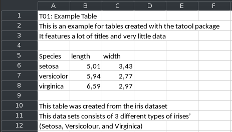
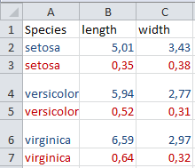
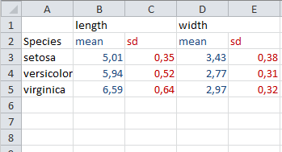
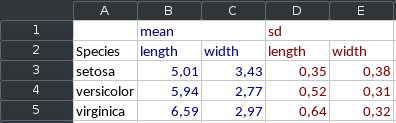
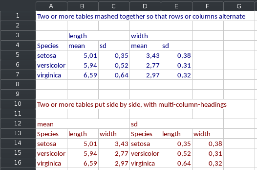

```{r message=FALSE, warning=FALSE}
library(magrittr)
library(tatoo)
```

# Introduction

tatoo ("table tools") functions to combine data.frames in ways that require 
additional effort in base R, and to add metadata (id, title, ...) that can be 
used for printing and xlsx export. The Tatoo_report class is provided as a 
convenient helper to write several such tables to a workbook, one table per 
worksheet.

Tatoo tables and reports can directly be saved to .xlsx files, or convert to
`Workbook` objects with `as_workbook()` so that you can process them further
using the *openxlsx* package. While tatoo implements convenient print
methods so that you can preview the tables you created in the console, most of
the functionality provided by this package only makes real sense for xlsx
export.

```{r}
df1 <- data.frame(
  Species = c("setosa", "versicolor", "virginica"),
  length = c(5.01, 5.94, 6.59),
  width = c(3.43, 2.77, 2.97)
)

df2 <- data.frame(
  Species = c("setosa", "versicolor", "virginica"),
  length = c(0.35, 0.52, 0.64),
  width = c(0.38, 0.31, 0.32)
)
```

# Tagged tables



`tag_table()` allows you to attach different levels of captioning to a 
data.frame or Tatoo_table. Those captions are used for printing and
.xlsx export.

```{r}
# Create metadata object
ex_meta <- tt_meta(
  table_id  = 'T01',  
  title     = 'Example Table', 
  longtitle = 'This is an example for tables created with the tatool package', 
  subtitle  = 'It features a lot of titles and very little data', 
  footer    = c('This table was created from the iris dataset', 
                'It consists of 3 different types of irises’',
                 '(Setosa, Versicolour, and Virginica)') 
)

# Create metadata object
tagged_table <- tag_table(
  df1,
  meta = ex_meta
)

print(tagged_table)
```

Metadata cann also be assigned an modified via set function.

```{r}
meta(df1)  <- ex_meta # df1 gets automatically converted to a Tagged_table

title(df1) <- 'A table with a title'
table_id(df1) <- NULL
longtitle(df1) <- NULL
subtitle(df1) <- NULL
footer(df1) <- NULL

print(df1)
```


# Mashed tables

 

<center>Tables combined with alternating rows or columns</center>


Combine two data.frames in such a way that you and up with alternating rows
or columns. Internally, a Mashed_table is just a list of two or more tables,
and metadata on how to combine them.

Mashed_tables can be constructed from individual data.frames or a list of 
data.frames

```{r}
mashed_table <- mash_table(df1, df2)
mashed_table <- mash_table_list(list(df1, df2)) # same as above

title(mashed_table) <- 'A mashed table'
subtitle(mashed_table) <- 
  'Two or more tables mashed together so that rows or columns alternate'

print(mashed_table)
```

Additional formatting parameters can be saved as attributes to a mash table. 
Those attributes honored by the print and (more significantly) the `as_workbook()` 
methods.

A row-mashed table
```{r}
mashed_table_row <- mash_table(
  df1, df2, 
  mash_method = 'row', 
  insert_blank_row = FALSE,
  meta = tt_meta(title = 'A row-mashed table')
)
print(mashed_table_row)
```

A col-mashed table
```{r}
mashed_table_col <- mash_table(
  mean = df1, sd = df2, 
  mash_method = 'col', 
  id_vars = 'Species',
  meta = tt_meta(title = 'A col-mashed table')
)

print(mashed_table_col)
```

The display parameters are just saved as attributes, and can be modified
conveniently via set functions. Named mashed tables will have two layers of
colnames in print and xlsx output.

```{r}
mash_method(mashed_table) <- 'col'
id_vars(mashed_table) <- 'Species'
names(mashed_table) <- c('mean', 'sd')

print(mashed_table)
```

You can also directly override the display parameters saved in the Mashed_table
object for printing and xlsx export

```{r}
print(mashed_table, mash_method = 'row', insert_blank_row = TRUE)
```


All Tatoo table classes can be converted to openxlsx Workbooks via 
`as_workbook()`. Examples for finished *.xlsx* files are beyond the scope
of this vignette.
```{r message=FALSE}
as_workbook(mashed_table)
```


## Convience functions
`rmash()` and `cmash()` are convient shortcut functions if you just need to quickly
mash together a data.frame (similar to `rbind()` and `cbind()`). Note that the
result is a data.table and not a data.frame, so if you are not familiar with
the data.table package you might want to manually convert the result to a
data.frame to prevent headaches.

### rmash

`rmash()` can be used on several data.frames or on an existing Mahed table.

```{r eval = FALSE}
rmash(df1, df2) 
rmash(mashed_table)   
```
```{r echo = FALSE}
rmash(df1, df2) 
```


`rmash()` also supports the `insert_blank_row` argument of `Mashed_table()` for 
consistency.

```{r}
rmash(df1, df2, insert_blank_row = TRUE)
```

### cmash

The interface of `cmash()` is very similar to `rmash()`
```{r eval = FALSE}
cmash(df1,  df2)
cmash(mashed_table)
```
```{r echo = FALSE}
cmash(df1, df2) 
```

More polished output can be produced by naming the inputs and using the 
`id_vars` argument.

```{r}
cmash(mean = df1, sd = df2, id_vars = 'Species')
```


# Composite tables



`comp_table()` works like `cbind()`, but separate super-headings are preserved 
for each table. Names for each table can be provided directly, or alternatively 
the `comp_table_list()` constructor can be used as above with mash_table.

```{r}
composite_table <- comp_table(mean = df1, sd = df2)
composite_table <- comp_table_list(list(mean = df1, sd = df2))  # same as above


title(composite_table) <- 'A composite table'
subtitle(composite_table) <- 
  'Two or more tables put side by side, with multi-column-headings'

print(composite_table)

```

When creating a Composite table, the `id_vars` argument can be used to combine 
the tables via merge, rather than via cbind.

```{r}
comp_table(mean = df1, sd = df2, id_vars = 'Species')
```


# Stacked tables



Stacked tables simply stack two tables above each other. The only meaningful
usecase for this at the moment is to put several tables above each other
on the same *.xlsx* sheet. A stack table can be consist of an arbitrary number
of data.frames or Tatoo_tables -- except other Stacked_tables.

```{r}
stacked_table <- stack_table(df1, mashed_table, composite_table)
stacked_table <- stack_table_list(list(df1, mashed_table, composite_table))  # same as above

title(stacked_table) <- 'A stacked table'
subtitle(stacked_table) <- 
  'A list of multiple tables, mainly useful for xlsx export'

print(stacked_table)
```


# Tatoo Report


A tatoo report is a list of an arbitrary number of Tatoo tables. When exported
to xlsx, a sepparate worksheet will be created for each element table.

```{r}
tatoo_report <- compile_report(
  tagged = tagged_table, 
  mashed_row = mashed_table_row,
  mashed_col = mashed_table_col, 
  composite = composite_table, 
  stacked = stacked_table
)

print(tatoo_report)


```

# Excel export

For further processing with *openxlsx*.
```{r}
wb <- as_workbook(tatoo_report)  
```

For direct xlsx export
```{r, eval = FALSE}
# save_xlsx(tatoo_report, paste(tempfile(), ".xlsx"), overwrite = TRUE)
```


